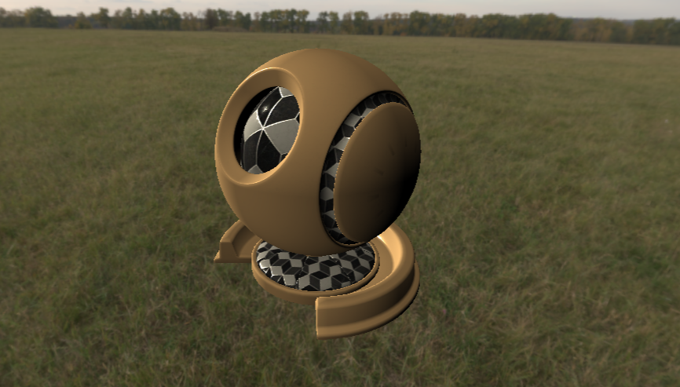

# RenderGraph

### 描述

基于Unity SRP RenderGraph的延迟渲染，目前还在开发中

Unity版本2022.3.14f1

#### 管线组织

1. GBuffer Pass
2. Shading Pass
3. Sky Pass
4. Final Blit Pass

#### GBuffer组成

|      | 格式   | 内容                                             |
| ---- | ------ | ------------------------------------------------ |
| MRT0 | RGBA32 | RGB: Albedo, A: shadow                           |
| MRT1 | RGBA32 | RGB: Emission + fog.xyz                          |
| MRT2 | RGBA32 | RGB: EncodeNormal.xyz, A: ShadingMode            |
| MRT3 | RGBA32 | R: Metallic, G: Roughness, B:Occlusion, A: fog.w |

#### 目前实现功能

- 延迟渲染框架
- 绘制不透明物体、天空盒
- 单主光源的PBR

#### 后续开发计划

- shadow
- fog
- stencil shading mode
- GI
- render feature

### 依赖

[JasonMa0012/LWGUI: A Lightweight, Flexible, Powerful Shader GUI System for Unity. (github.com)](https://github.com/JasonMa0012/LWGUI)
